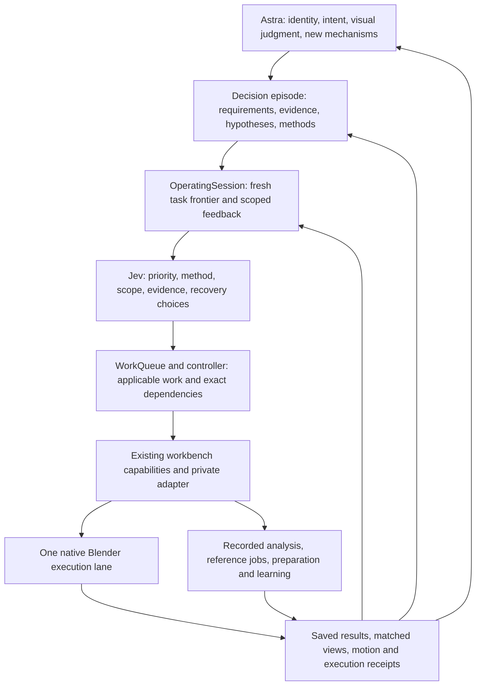

# Astra and Jev modeling system

The system improves a character through recoverable, evidence-bound decisions.
Astra and Jev operate one workbench: Astra maintains the intended character and
interprets appearance; Jev distributes contextual choices across executable work;
the workbench supplies truthful state, qualified action, recovery and accumulated
methods. The unit of continuity is the existing **decision episode**, not a model
conversation, isolated command, or second parallel planning ledger.

## Linked abstractions

| Layer | Meaning and owner | Existing implementation |
| --- | --- | --- |
| Character intent | Accepted identity, current checkpoint, protected work and authorized resources. Astra maintains the bounded question; the user remains artistic authority. | Private current-state documents, workspace binding, episode requirements |
| Decision episode | A recoverable question joins state, observations, guides, interventions, independent judgments and retained methods. | `episodes`, `decision_workspace`, immutable store and semantic graph |
| Operating session | Compile eligible work and fresh findings; keep Astra feedback, Jev choices and actual operations linked to that episode. | `OperatingSession`, `operating_protocol`, `inspect_operating_session` |
| Work frontier | Useful operations in diagnosis, repair, verification, review, recovery, experience and preparation. Dependencies describe what can proceed. | `WorkQueue`, recipes and provider workflow graphs |
| Contextual selection | Jev chooses offered methods, scopes and next work from current facts, uncertainties and applicable retained experience. | `LaneSelector`, typed `judgments`, direct TypeSafe transport and workspace budget ledger |
| Qualified capability | A reusable operation carries its method, exact input relationships, executable implementation, completion evidence and resource effects. | Existing service operations or trusted private handlers; no new parallel geometry API |
| Effect and observation | Execute directly, protect user work, save actual results and report what happened. Native writes are serial. | Controller, native adapter, worker contract, transaction/job receipts, operation journal |
| Learning | Distinguish local character gain, technical execution and method benefit. Preserve cause, failure, scope and actual reuse. | `record_outcome`, `reconcile_episode`, `promote_procedure`, `retrieve_experience` |

Repeated candidate work uses `CandidatePipeline` to materialize qualified stages
from actual predecessor results. It freezes dependency bindings and composes the
existing work frontier; it does not introduce another executor or evidence store.
Recorded-array guide fitting supplies section provenance, bounded interpolation,
material allocation and explicit displacement coordinates below the capability
layer. Session metrics join observed runtime, actual reviews and reported Astra
interventions so workload improvements can be evaluated without invented speedups.

Every row has links to the rows above and below. A short observation expands to
an exact operation, input identity, original artifact, procedure and judgment.
The queue is an execution index; native files, generation jobs, episode records
and current human authority keep their existing meanings. Attaching a session
preserves historical queue receipts without relabeling their provenance.

## Control and feedback

Astra sets the art direction, chooses a discriminating question and supplies a
bounded frontier of qualified capabilities. It can refine requirements or submit
scoped visual feedback while unrelated work proceeds. Jev takes recurring
priority, method, scope, evidence and recovery decisions and dispatches directly
to code. Astra does not perform a second native handoff, nor directly inspect,
pose, capture, save or edit Blender. Fixed prerequisites inside an authorized
selected operation are deterministic and need no gratuitous inference.

A selected task enters the existing episode lease and operation journal before
its effects. It captures applicable workbench procedure context, executes the
existing capability, retains its raw return, and indexes typed evidence and
findings. Each next Jev decision automatically receives those findings and fresh
Astra feedback. A static startup summary can no longer omit a newly measured
no-op or support limit. Stale facts remain historical; fresh authority, relevant
inputs, output receipts and public observation revisions control applicability.

A candidate can execute successfully while its output qualification is incomplete
or appearance is unresolved. Saving and recovery remain available. Scoped
retention consumes explicit candidate/reopen evidence and a current actual-image
judgment. User acceptance and general method benefit are never inferred. A worse
numerical metric does not veto a visual gain; a no-op on one side does not erase a
gain on the other. Failed mechanisms retain their cause and applicability so the
next repair changes a justified mechanism rather than only a candidate label.

## Preserve the successful modeling process

The workbench loop remains current situation -> causal diagnosis -> qualified
support -> recoverable guided correction -> early matched visual comparison ->
relevant motion and independent reopen -> retained gain and method. These are
purposeful dependencies, not a fresh exhaustive audit before every action.

Accepted identity and source/pose/side-specific guide dispositions govern target
use. Registered geometry, depth and corresponding sections constrain every
appearance edit during construction, including attachments, smoothing and joins.
Semantic correspondence, target-domain coverage, topology lineage and evaluated
response evidence remain explicit. A screenshot, nearest point, scalar fit score
or post-hoc distance cannot replace those relations.

Native operations preserve baseline and later user edits, save actual checkpoints
and produce sparse matched whole/context and close views early. Broader motion,
angles and independent reopen follow a useful candidate or a concrete structural
question. Keep the useful editable model and relevant guide visible through the
existing native display/status capability. Live output must report stopped,
completed and failed jobs accurately.

Reference generation continues through the existing reviewed-source job lifecycle:
view/identity roles -> image review -> surface review -> registration and scoped
qualification -> guide-constrained fitting. Source rejection invalidates dependent
targets. Source-bound claim/reconciliation, observed provider settings and existing
budgets remain mandatory; an uncertain dispatch is never submitted twice.

The full capability inventory has explicit control-lane mappings, verified by
synthetic tests. Numerical queries, camera/pixel relations, motion, reference
loops, construction/attachment diagnostics, guide fitting, response prediction,
recipes, component catalogs, graph paths, topology lineage, native mesh/library
transactions, recovery, evidence export and method promotion remain available.
The new control layer composes them; it does not supersede their contracts.

## Scale by reducing repeated interpretation

Batch independent Jev choices against compact structured state, including useful
conditional options, then consume only applicable answers. Cache exact evidence-
and question-bound answers. Keep large arrays, native identity and private paths
local; expand exact evidence only when a decision needs it. Bound public findings
and expose missing context instead of silently truncating contradictory evidence.

Independent immutable preparation can be pipelined by qualified workspace
adapters; shared native effects remain serial. The current queue itself executes
handlers serially. This release does not claim parallel Blender writes or a
measured modeling speedup. Existing controller timing, provider receipts and actual
use distinguish selection latency, preparation, native work and review cost.

Astra should spend effort on likeness, contradictory evidence and genuinely new
mechanisms. Routine useful decisions move to Jev; mandatory bookkeeping moves to
code. A new method enters the same capability/report interface once qualified,
then becomes immediately reusable rather than a candidate-specific orchestration
script. Learning retains failed alternatives and the precise scope of success.

## Recovery and verification

Known returned results repair the queue/controller index without replay. Unknown
native/provider effects require the original receipt and explicit reconciliation.
Raw results survive failure of later report validation or indexing. A bounded
Windows sharing retry repeats only a metadata rename, never an operation.

Tests cover the composed episode/queue lifecycle, automatic fresh findings, guide
invalidation, scoped visual feedback, incomplete output checks, preserved historical
receipts and crash recovery. Installation bytes, actual selected runtime, private
native qualification and operator adoption are verified separately. Synthetic
success is not evidence of final character quality or universal character support.

Use the [operator contract](modeling_system/plugin/skills/modeling-workbench/references/operating-session.md)
for the exact API and migration. Earlier rationale and detailed contracts remain
in [design evolution](modeling_system/plugin/skills/modeling-workbench/references/design-evolution.md)
and the linked feature references. The [implementation record](IMPLEMENTATION-QUEUE.md)
keeps implementation and observed adoption distinct.
